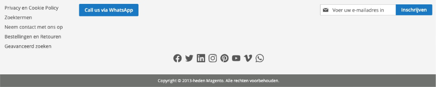

# Siteation - Magento 2 Module Store Info Extra

[](https://packagist.org/packages/siteation/magento2-module-storeinfo-extra)

[](https://hyva.io/)


This Magento 2 module add the option to show social buttons or more extras with ease.

So you can get the whatsapp number from the Stores > Config.
Instead using static block or hard code it in your template directly.

## Installation

Install the package via;

```bash
composer require siteation/magento2-module-storeinfo-extra
bin/magento setup:upgrade
```

> This Module require Magento 2.3 or higher!
> For more requirements see the `composer.json`.

## How to use

By defaut this module loads nothing.

Use one of the samples to get started.

After this Enter your information in the avaible options found in Stores > Configuration > General > General > Store Extra information

### Adding a social buttons

```xml
<!-- Luma Sample -->
<referenceContainer name="footer">
    <block name="footer.store.socials"
        as="footer-store-socials"
        template="Siteation_StoreInfoExtra::luma/socials.phtml">
        <arguments>
            <argument name="viewModelStoreInfo" 
                xsi:type="object">Siteation\StoreInfoExtra\ViewModel\StoreInfoExtra</argument>
        </arguments>
    </block>
</referenceContainer>
<!-- Hyva Sample -->
<referenceContainer name="footer">
    <block
        name="footer.store.socials"
        as="footer-store-socials"
        template="Siteation_StoreInfoExtra::hyva/socials.phtml"
    />
</referenceContainer>
```

### Adding a Whatsapp call us button

```xml
<!-- Luma Sample -->
<referenceContainer name="footer">
    <block name="footer.store.whatsapp"
        as="footer-store-whatsapp"
        template="Siteation_StoreInfoExtra::luma/whatsapp-button.phtml">
        <arguments>
            <argument name="viewModelStoreInfo" 
                xsi:type="object">Siteation\StoreInfoExtra\ViewModel\StoreInfoExtra</argument>
        </arguments>
    </block>
</referenceContainer>
<!-- Hyva Sample -->
<referenceContainer name="footer">
    <block
        name="footer.store.whatsapp"
        as="footer-store-whatsapp"
        template="Siteation_StoreInfoExtra::hyva/whatsapp-button.phtml"
    />
</referenceContainer>
```

### Extending

<!-- TODO -->

[See the Wiki](https://github.com/Siteation/magento2-module-storeinfo/wiki)
on some nice use cases.

## Preview sample


